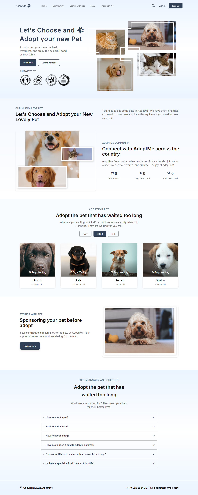

# 🐾 AdobtMe

**AdobtMe** adalah aplikasi antarmuka web yang dibuat untuk memudahkan pengguna dalam mencari dan mengadopsi hewan peliharaan. Dibangun menggunakan **Vue.js** dan **Tailwind CSS**, aplikasi ini menampilkan tampilan modern, responsif, dan mudah digunakan.

## 🚀 Fitur Utama

- 📋 Daftar hewan peliharaan siap adopsi
- 🔍 Filter dan pencarian berdasarkan jenis atau lokasi
- 🐶 Tampilan detail hewan (foto, deskripsi, usia, jenis, lokasi)
- 📱 Desain responsif, cocok untuk perangkat mobile dan desktop
- 💡 Komponen reusable berbasis Vue.js
- 🎨 Styling elegan menggunakan Tailwind CSS

## 🧱 Struktur Proyek

```
AdobtMe/
├── public/            # File publik dan aset gambar
├── src/
│   ├── assets/        # Gambar & ikon
│   ├── components/    # Komponen Vue (Navbar, Card, Footer, dsb)
│   ├── views/         # Halaman (Home, About, Adopt, dsb)
│   ├── router/        # Konfigurasi routing dengan Vue Router
│   ├── App.vue        # Komponen root
│   └── main.js        # Entry point aplikasi
├── tailwind.config.js # Konfigurasi Tailwind CSS
└── vite.config.js     # Konfigurasi Vite
```

## 🛠️ Teknologi

- [Vue.js 3](https://vuejs.org/)
- [Tailwind CSS](https://tailwindcss.com/)
- [Vite](https://vitejs.dev/)
- [Heroicons](https://heroicons.com/)

## 📦 Instalasi

1. **Clone repositori:**

```bash
git clone https://github.com/adidarma24/AdobtMe.git
cd AdobtMe
```

2. **Install dependencies:**

```bash
npm install
```

3. **Jalankan di lokal:**

```bash
npm run dev
```

Aplikasi akan berjalan di `http://localhost:5173`

## 📸 Cuplikan Tampilan



## 🤝 Kontribusi

Kontribusi sangat terbuka! Silakan fork repo ini, buat branch baru, dan ajukan pull request.

## 📄 Lisensi

[MIT License](LICENSE)

---

Created with ❤️ by [Adi Dharma Putra](https://github.com/adidarma24)
